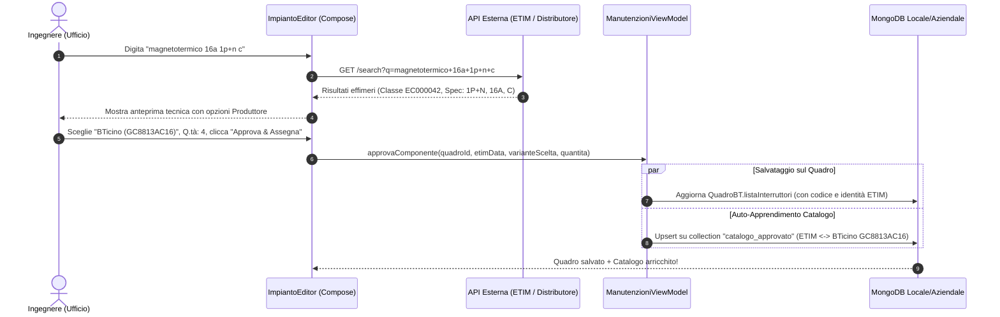

# Untitled

Questo approccio è formidabile: in ingegneria del software si chiama **"Human-in-the-Loop Catalog Hydration"** (o *Catalogo Curato Progressivo*).

Invece di sovraccaricare MongoDB con milioni di articoli obsoleti o non pertinenti:

1. **L'API esterna fa da "motore di scoperta"** in tempo reale (dati effimeri, solo in memoria).
2. **L'utente fa da "garante tecnico":** verifica, seleziona il produttore e approva.
3. **MongoDB salva solo l'oro colato:** memorizza il componente nel quadro **e** archivia in automatico la relazione tecnica (ETIM ↔ Produttore ↔ Codice) nel catalogo interno dell'azienda.

In questo modo, **più l'ufficio usa l'app, più il MongoDB aziendale diventa una miniera d'oro di componenti ed equivalenze certificate**, a costo di storage quasi nullo.

---

### 1. Il Ciclo di Vita del Componente: Da Effimero ad Approvato



---

### 2. Le Due Strutture Dati su MongoDB

Con questa strategia, su MongoDB avremo due soli punti di persistenza, puliti e snelli:

#### A. Nella scheda del Quadro (`QuadroBT`)

Il quadro memorizza l'esatto componente approvato con la sua quantità e la sua carta d'identità ETIM:

```json
{
  "nome": "Magnetotermico 1P+N C16 4.5kA",
  "quantita": 4,
  "siglaCircuito": "F1 - Prese",
  "produttore": "BTicino",
  "codiceArticolo": "GC8813AC16",
  "etimClassId": "EC000042",
  "etimClassName": "Interruttore magnetotermico",
  "specifiche": {
    "poli": "1P+N",
    "correnteNominale": "16A",
    "curva": "C",
    "potereInterruzione": "4.5kA"
  }
}
```

#### B. Nella nuova collection `catalogo_approvato` (La base di conoscenza aziendale)

Ogni volta che l'utente approva un componente, il backend esegue un **`upsert`** aggregando i produttori approvati per quella stessa specifica ETIM:

```json
{
  "_id": "EC000042_1PN_16A_C_45KA",
  "etimClassId": "EC000042",
  "descrizioneStandard": "Interruttore magnetotermico 1P+N 16A C 4.5kA",
  "specifiche": {
    "poli": "1P+N",
    "correnteNominale": "16A",
    "curva": "C",
    "potereInterruzione": "4.5kA"
  },
  "alternativeApprovate": {
    "BTicino": { "codice": "GC8813AC16", "dataApprovazione": "2026-09-15" },
    "ABB": { "codice": "SN201LC16", "dataApprovazione": "2026-10-02" }
  }
}
```

*Se oggi approvi BTicino, viene salvato BTicino. Se tra un mese su un altro quadro approvi l'equivalente ABB per la stessa specifica, MongoDB unisce le due alternative sotto lo stesso ETIM!*

---

### 3. Come si presenta la UI di Approvazione (Wireframe)

In [ImpiantoEditor.kt](file:///Users/edoardo/development_prdj/fdf_builder/desktopApp/src/desktopMain/kotlin/manutenzioni/app/ui/ImpiantoEditor.kt), mentre l'utente digita nella barra di ricerca:

```
┌────────────────────────────────────────────────────────────────────────────────────────┐
│  RICERCA COMPONENTE VIA API                                                            │
├────────────────────────────────────────────────────────────────────────────────────────┤
│  Cerca: [ magnetotermico 1P+N 16A C 4.5kA____________________________________________ ]│
│                                                                                        │
│  🔍 RISULTATO API IDENTIFICATO:                                                        │
│  Classe ETIM: EC000042 (Interruttore magnetotermico)                                   │
│  Parametri:   1P+N | In=16A | Curva C | Icn=4.5kA | 1 Modulo DIN                       │
│                                                                                        │
│  Seleziona Produttore da associare al Quadro:                                          │
│  (•) BTicino  -> Codice: [ GC8813AC16  ]                                               │
│  ( ) ABB      -> Codice: [ SN201 L C16 ]                                               │
│  ( ) Schneider-> Codice: [ A9N21556    ]                                               │
│                                                                                        │
│  Dati Quadro:                                                                          │
│  Quantità: [ 4 ]   Sigla Circuito: [ F1-FM ]                                           │
│                                                                                        │
│                                           [ Annulla ]  [ ⭐ APPROVA E ASSEGNA (Invio) ]│
└────────────────────────────────────────────────────────────────────────────────────────┘
```

---

### 4. Il Risultato per la Gestione Futura (Sostituzione / Offerte)

Quando un giorno l'utente vorrà valutare una sostituzione o un'offerta per quel quadro:

1. L'app non deve chiamare nessuna API: guarda direttamente in **`catalogo_approvato`** su MongoDB.
2. Trova che per `EC000042_1PN_16A_C_45KA` ci sono già i codici **certificati dall'azienda** per BTicino, ABB e Schneider.
3. Se invece l'utente vuole un marchio non ancora registrato (es. *Siemens*):
    - Clicca *"Cerca equivalente Siemens via API"*.
    - L'API propone il codice `5SL6516-7`.
    - L'utente approva: il quadro si aggiorna e MongoDB impara anche il codice Siemens per il futuro!

---

### 5. Prossimi Passi per l'Implementazione

Per realizzare questo flusso, i passi tecnici sono:

1. **Domain Model:** Aggiornare [ManutenzioneModels.kt](file:///Users/edoardo/development_prdj/fdf_builder/desktopApp/src/desktopMain/kotlin/manutenzioni/domain/model/ManutenzioneModels.kt) con la classe `InterruttoreBT` arricchita (campi ETIM e produttore).
2. **Service Layer (API):** Creare il client HTTP (Ktor) con l'interfaccia `ProductSearchApi` per interrogare il servizio ETIM/Distributore.
3. **Repository Layer:** Aggiungere a `MongoManutenzioneRepository` la gestione della collection `catalogo_approvato` (con operazione di `upsert`).
4. **UI Layer:** Aggiungere in `ImpiantoEditor` la modale o pannello di ricerca rapida con pulsante *"Approva e Assegna"*.

Se ti piace questa impostazione, posso iniziare a preparare le modifiche al modello dati e all'interfaccia del servizio API!